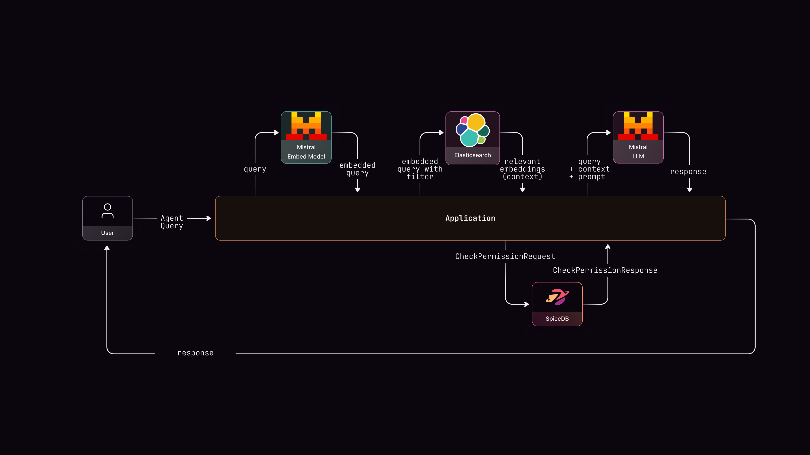
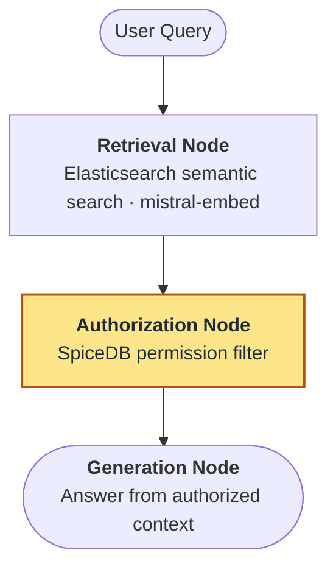
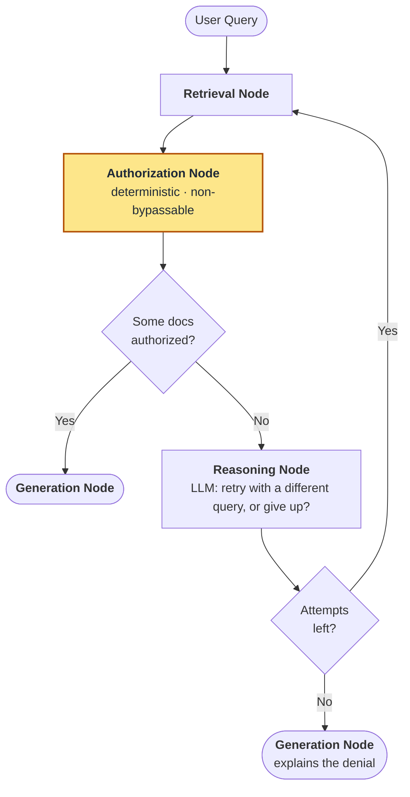

# Agentic RAG with Fine-Grained Authorization

This repository demonstrates how to combine agentic behavior with deterministic fine-grained authorization using LangGraph, SpiceDB, [Elasticsearch](https://github.com/elastic/elasticsearch), and [Mistral](https://mistral.ai/). You'll learn to build RAG systems where a user can only see information from the documents they have access to.

This project uses the [LangChain SpiceDB](https://pypi.org/project/langchain-spicedb/) library.


## TL;DR (human-written)

RAG systems typically focus on the retrieval mechanisms, but don't have fine-grained access control to check if the information retrieved is accessible to the user asking the query. This demo shows the setup for a prod-like Agentic RAG. It has a corpus of 50 documents with complex sharing requirements that span individual, departments and exceptions. 

The two takeaways from this demo are:

1. Using ReBAC makes it simple to model complex hierarchal permissions. The complexity increases in the context of RAG and AI Applications as there are 10x more principals, so traditional authorization methods such as RBAC fall flat.

2. Never ever let an AI Agent *decide* if it needs to check for authorization. Gen AI is inherently probabilistic so you have to ensure that permission checks are deterministic and cannot be skipped.

The diagram below shows the end-to-end request flow: the application embeds the query with Mistral, retrieves relevant context from Elasticsearch, checks permissions in SpiceDB, and only then passes the authorized context to the Mistral LLM to generate a response.



## What You'll Learn

This repo demonstrates:

1. **Fine-grained authorization in Agentic RAG** - How to enforce document-level permissions with SpiceDB so users only see what they're allowed to see
2. **Security architecture** - A deterministic authorization boundary that cannot be bypassed by the agent
3. **Production features** - Structured logging, connection pooling, batch operations, error handling
4. **Real-world complexity** - 50 documents, 4 permission patterns with hierarchies

Note: Despite the "agentic RAG" name, the default mode is intentionally simple and deterministic (3 nodes: retrieve → authorize → generate). This provides fast, predictable behavior suitable for most use cases. There is a `MAX_RETRIEVAL_ATTEMPTS` option where the AI Agent can reason if it has to retrieve more data.

## The Problem This Solves

Traditional RAG retrieves documents by semantic similarity without considering permissions. This creates two issues:

1. **Security risk**: Users might see documents they shouldn't access
2. **Poor UX**: Silent failures when documents are denied, with no explanation

Read the [OWASP Top 10 for LLM](https://owasp.org/www-project-top-10-for-large-language-model-applications/) and [OWASP Top 10 Risks to Web Apps](https://owasp.org/Top10/2025/A01_2025-Broken_Access_Control/) for more on why access control matters.

## The Solution

This implementation shows how to combine:
- **Retrieval-first approach**: Semantic vector search (Mistral embeddings in Elasticsearch) without upfront planning overhead
- **Deterministic security**: SpiceDB authorization that cannot be bypassed
- **Transparency**: Users understand what they can and can't access, and why

```
Traditional RAG:  Query → Retrieve → Generate
                           ↓
                    (no permission checks)

This approach (default):  Query → Retrieve → [SpiceDB Authorizes] → Generate
                                               ↓
                                       Security boundary
```

## Quick Example

```bash
# Alice (engineering department) queries engineering docs
Query: "What are our system architecture best practices?"
User: alice

Result:
✅ Retrieved: 3 documents via semantic search
✅ Authorized: 2 documents (eng-001, eng-002)
❌ Denied: 1 document (hr-001)

Answer: "Based on the engineering documents, our system uses microservices architecture with event-driven patterns..."
```

```bash
# Bob (sales department) queries engineering docs
Query: "What are our system architecture best practices?"
User: bob

Result:
✅ Retrieved: 3 documents
❌ Authorized: 0 documents
❌ Denied: 3 documents

Answer: "I don't have access to the engineering documents needed to answer this question. This information is restricted to the engineering department."
```

The agent transparently explains access limitations instead of failing silently.

## Setup & Run (5 minutes)

The demo runs entirely through the web UI, which lets you switch users and watch the authorization boundary filter results in real time.

### Prerequisites
- Docker & Docker Compose
- Python 3.11+
- Mistral API key

### Steps

```bash
# 1. Configure — add your Mistral API key to the new .env file
cp .env.example .env

# 2. Start Elasticsearch + SpiceDB
docker-compose up -d

# 3. Install dependencies (includes FastAPI + Uvicorn for the UI)
python3 -m venv venv
source venv/bin/activate
pip install -r requirements.txt

# 4. Initialize data — embed 50 documents into Elasticsearch
#    and write the permission model to SpiceDB
python3 examples/setup_environment.py

# 5. Launch the web UI (runs pre-flight checks, then opens your browser)
python3 run_ui.py
```

`setup_environment.py` sets up Elasticsearch as the vector database and SpiceDB with sample documents and department-based access control. It embeds all 50 documents using Mistral's `mistral-embed` and indexes them into Elasticsearch, then writes a hierarchical permission model to SpiceDB: users assigned to departments, department-wide document access, 3 cross-department collaboration grants, and 3 individual user exceptions.

`run_ui.py` verifies Elasticsearch and SpiceDB connectivity, confirms the documents are loaded, starts the FastAPI server, and opens http://localhost:8000.

## How It Works

### 1. Authorization Model (SpiceDB)

```zed
definition user {}

definition department {
    relation member: user
}

definition document {
    relation owner: user
    relation viewer: user | department#member

    permission view = viewer + owner
    permission edit = owner
}
```

**Relationships:**
- `alice` is a member of `engineering` department
- `eng-001` document has viewer = `engineering#member`
- Result: alice can view eng-001 ✅

### 2. State Flow

**Default Mode (`max_attempts=1`)**



The **Authorization Node** (highlighted) is the security boundary: it always runs, it's deterministic, and the agent cannot bypass it.

**Adaptive Mode (`max_attempts > 1`)**

When `max_attempts` is set above 1, a reasoning node activates if authorization fails. The LLM analyzes why access was denied and decides whether a different retrieval strategy might find documents the user *can* access:



For example, if Bob (sales) asks about "microservices architecture" and the first retrieval returns only engineering-restricted docs, the reasoning node might try a broader query that surfaces a shared architecture doc Bob can actually access.

Enable it by setting `MAX_RETRIEVAL_ATTEMPTS` in `.env`:

```bash
MAX_RETRIEVAL_ATTEMPTS=3  # default is 1
```

### 3. Security Guarantees

- **Authorization always runs**: Hardcoded in the LangGraph workflow — the agent cannot skip it
- **Deterministic checks**: SpiceDB enforces permissions (no LLM involved in the decision)
- **Fail closed**: Access denied unless explicitly granted
- **Observable**: Full audit trail in state

## Configuration

Environment variables (`.env`):

```bash
# Required
MISTRAL_API_KEY=...

# Optional (defaults shown)
ELASTICSEARCH_URL=http://localhost:9200
ELASTICSEARCH_API_KEY=
SPICEDB_ENDPOINT=localhost:50051
SPICEDB_TOKEN=devtoken
MAX_RETRIEVAL_ATTEMPTS=1
LOG_LEVEL=INFO
```

## Dataset Overview

The repository includes a realistic 50-document dataset across 5 departments.

**Authorization Patterns:**
1. Department-based access (primary pattern)
2. Cross-department collaboration (3 shared documents)
3. Individual user exceptions (3 special grants)
4. Public documents (accessible to all users)

See [data/PERMISSIONS.md](data/PERMISSIONS.md) for the complete permission matrix.

## Learn More

- **SpiceDB**: https://authzed.com/docs
- **Elasticsearch**: https://www.elastic.co/docs
- **Mistral**: https://docs.mistral.ai/
- **LangGraph**: https://langchain-ai.github.io/langgraph/
- **langchain-spicedb**: https://github.com/authzed/langchain-spicedb

## License

MIT
