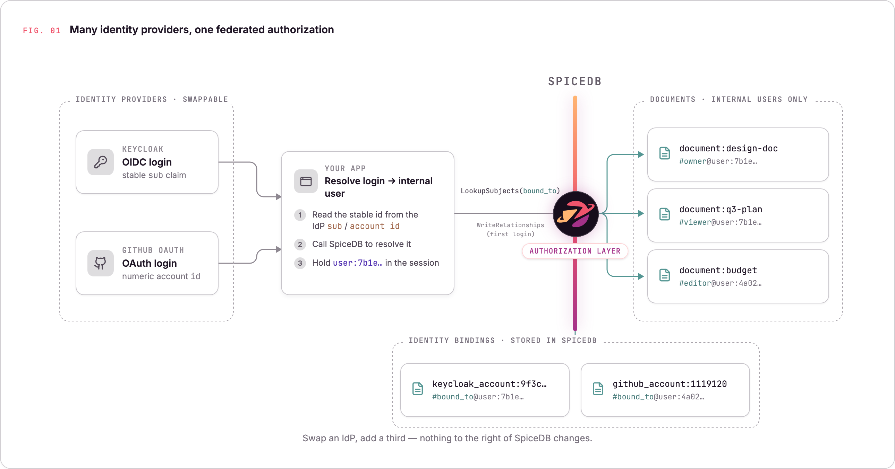

# Federated AuthZ Demo

A self-contained demo proving **federated authentication + centralized fine-grained authorization** using SpiceDB.

Different organizations use different identity providers, but a single SpiceDB instance enforces fine-grained document access control across all of them — and users from different IdPs can share resources with each other.

---

## Architecture



```
┌─────────────────────────────────────────────────────────────┐
│                    Enterprise AuthZ Layer                    │
│                                                             │
│  ┌──────────────┐    ┌──────────────┐    ┌──────────────┐  │
│  │   Keycloak   │    │   GitHub     │    │   SpiceDB    │  │
│  │   (Org A)    │    │   OAuth      │    │  (AuthZ)     │  │
│  │              │    │   (Org B)    │    │              │  │
│  │  alice       │    │  bob (any    │    │  Relationships│  │
│  │  carol       │    │  GH account) │    │  + Schema    │  │
│  └──────┬───────┘    └──────┬───────┘    └──────┬───────┘  │
│         │                   │                   │          │
│         └──────────┬────────┘                   │          │
│                    │                            │          │
│              ┌─────▼────────────────────────────▼──────┐   │
│              │           FastAPI App (Python)           │   │
│              │                                         │   │
│              │  1. OAuth/OIDC callback → extract sub   │   │
│              │  2. Resolve/create internal user UUID   │   │
│              │  3. All authz checks → SpiceDB only     │   │
│              └─────────────────────────────────────────┘   │
└─────────────────────────────────────────────────────────────┘
```

### The Federated Identity Pattern

**Key insight**: Every IdP gets its own SpiceDB object type, bound to a canonical internal `user` object. Document permissions are always granted to `user:<uuid>`, never to raw IdP subjects. This means a Keycloak user and a GitHub user can share resources without either IdP knowing about the other.

**Login flow (both providers):**
1. User completes OAuth/OIDC flow → app receives an IdP-specific subject ID
2. App checks SpiceDB: does `keycloak_account:<sub>#bound_to` (or `github_account:<id>#bound_to`) exist?
3. If yes → use the existing `user:<uuid>` from that relationship
4. If no → mint a new UUID, write the binding to SpiceDB, store profile in SQLite
5. Session cookie stores the internal `user:<uuid>` — all subsequent checks use only this

**SpiceDB schema:**
```
definition user {}

definition keycloak_account {
    relation bound_to: user
}

definition github_account {
    relation bound_to: user
}

definition document {
    relation owner: user
    relation editor: user
    relation viewer: user

    permission edit = editor + owner
    permission view = viewer + edit
    permission share = owner
}
```

---

## Prerequisites

- Docker and Docker Compose
- A GitHub account (to test cross-IdP sharing)
- A GitHub OAuth App (instructions below)

---

## Step 1: Register a GitHub OAuth App

1. Go to [github.com/settings/developers](https://github.com/settings/developers)
2. Click **OAuth Apps** → **New OAuth App**
3. Fill in:
   - **Application name**: `FedAuthZ Demo` (or anything)
   - **Homepage URL**: `http://localhost:8000`
   - **Authorization callback URL**: `http://localhost:8000/auth/github/callback`
4. Click **Register application**
5. Note the **Client ID**
6. Click **Generate a new client secret** and note the **Client Secret**

---

## Step 2: Configure Environment

Copy `.env.example` to `.env` and fill in your GitHub credentials:

```bash
cp .env.example .env
```

Edit `.env`:
```env
GITHUB_CLIENT_ID=your_actual_github_client_id
GITHUB_CLIENT_SECRET=your_actual_github_client_secret
SESSION_SECRET=some-long-random-string-here
```

The Keycloak values are pre-configured for local development and do not normally need
to change.  Two separate addresses exist because of Docker networking:

| Variable | Default | Used for |
|---|---|---|
| `KEYCLOAK_ISSUER` | `http://keycloak:8080/realms/org-a` | Server-to-server: token exchange, JWKS fetch, userinfo. Resolved from inside the app container via the Docker bridge network. |
| `KEYCLOAK_PUBLIC_ISSUER` | `http://localhost:8080/realms/org-a` | Browser-facing: the authorization redirect URL sent to the user's browser. The host port `8080` is what Keycloak exposes to the outside world. |

The hostname `keycloak` is only resolvable from inside the Docker network; the user's
browser on the host cannot reach it.  Conversely, `localhost:8080` refers to the host's
own loopback inside a container, not to the Keycloak container, so the app cannot use it
for server-to-server calls.

---

## Step 3: Start the Stack

```bash
docker-compose up --build
```

Wait for all services to be healthy. Keycloak takes ~60 seconds to start the first time.

- **App**: http://localhost:8000
- **Keycloak Admin**: http://localhost:8080 (admin / admin)
- **SpiceDB HTTP**: http://localhost:8090

---

## Demo Walkthrough

### Session 1 — Alice (Keycloak / Org A)

Open http://localhost:8000 in a browser.

1. Click **Log in with Keycloak (Org A)**
2. Log in as `alice@keycloak.com` / `alice123`
3. You are redirected to the dashboard — no documents yet

**What SpiceDB recorded:**
```
keycloak_account:<alice-sub>#bound_to@user:<alice-uuid>
```

4. Click **+ New Document**, give it a title and some content, click **Create Document**

**What SpiceDB recorded:**
```
document:<doc-id>#owner@user:<alice-uuid>
```

5. Note the document URL: `http://localhost:8000/documents/<doc-id>`

### Session 2 — Bob (GitHub / Org B)

Open a **private/incognito browser window** and go to http://localhost:8000.

1. Click **Log in with GitHub (Org B)**
2. Authorize the app with your GitHub account
3. You land on the dashboard — no documents visible (correct!)

**What SpiceDB recorded:**
```
github_account:<github-numeric-id>#bound_to@user:<bob-uuid>
```

4. Try visiting Alice's document URL directly → you get **403 Access Denied**
   SpiceDB's CheckPermission returns `PERMISSIONSHIP_NO_PERMISSION`

### Session 1 — Alice shares with Bob

Back in Alice's browser:

5. Open the document, scroll to **Share This Document**
6. Bob's GitHub account appears in the dropdown (fetched from SQLite `users` table — for display only)
7. Select Bob, choose **Viewer**, click **Share**

**What SpiceDB recorded:**
```
document:<doc-id>#viewer@user:<bob-uuid>
```

### Session 2 — Bob accesses the shared document

Back in Bob's browser:

8. Refresh the dashboard — Alice's document now appears (LookupResources finds it)
9. Click the document — content is visible (CheckPermission: `view` → `PERMISSIONSHIP_HAS_PERMISSION`)
10. No edit form or Share section visible (Bob only has `viewer` permission)

### Verify Revocation

Alice can click **Revoke** next to Bob's entry. Bob's document disappears from his dashboard immediately on the next request — SpiceDB is the live source of truth.

---

## SpiceDB Relationships Written During Walkthrough

| Step | Relationship written |
|------|---------------------|
| Alice first login | `keycloak_account:<kc-sub>#bound_to@user:<alice-uuid>` |
| Bob first login | `github_account:<gh-id>#bound_to@user:<bob-uuid>` |
| Alice creates document | `document:<doc-id>#owner@user:<alice-uuid>` |
| Alice shares with Bob (viewer) | `document:<doc-id>#viewer@user:<bob-uuid>` |
| Alice shares with Bob (editor) | `document:<doc-id>#editor@user:<bob-uuid>` |
| Alice revokes Bob's access | (relationship deleted) |

---

## SpiceDB API Calls Made by the App

| Operation | SpiceDB API | Used for |
|-----------|-------------|----------|
| First login (new user) | `WriteRelationships` | Record IdP→user binding |
| Login (returning user) | `ReadRelationships` | Look up existing binding |
| Dashboard load | `LookupResources` | Find all viewable docs |
| Document open | `CheckPermission(view)` | Gate document access |
| Edit form display | `CheckPermission(edit)` | Show/hide edit UI |
| Share section display | `CheckPermission(share)` | Show/hide share UI |
| Save edit | `CheckPermission(edit)` | Server-side auth check |
| Share action | `WriteRelationships` | Grant access |
| Revoke action | `DeleteRelationships` | Revoke access |
| Share page sharees | `ReadRelationships` | List current access |

---

## File Layout

```
federated-authz-demo/
├── app.py                  # FastAPI application
├── Dockerfile
├── docker-compose.yml
├── requirements.txt
├── .env.example
├── .gitignore
├── spicedb/
│   └── schema.zed          # SpiceDB schema (source of truth)
├── keycloak/
│   └── realm-export.json   # Pre-seeded Org A realm with alice + carol
├── templates/              # Jinja2 server-rendered HTML
│   ├── base.html
│   ├── login.html
│   ├── dashboard.html
│   ├── document_new.html
│   ├── document_view.html
│   └── error.html
├── static/
│   └── style.css
└── data/
    └── documents/          # Document files (volume-mounted)
```
